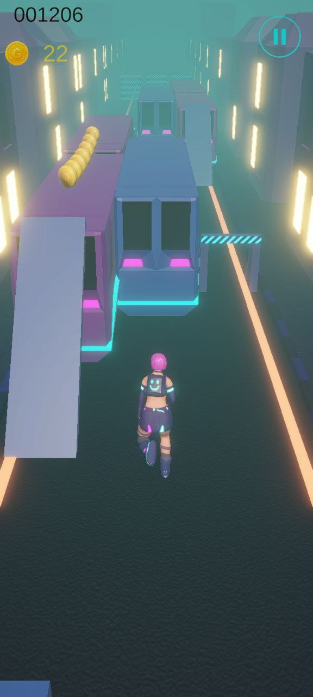
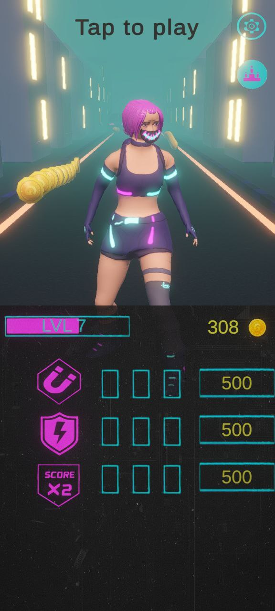
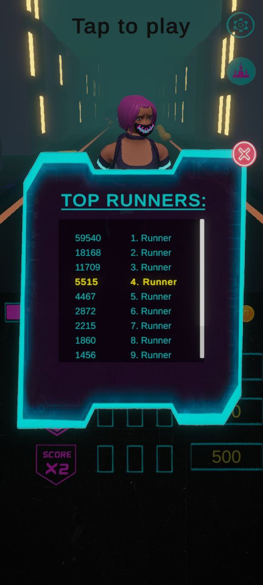

# NEO RUN 🏃‍♀️✨

**NEO RUN** — это динамичный бесконечный раннер в стилистике киберпанка. Игрок управляет девушкой, бегущей по залитому неоном ночному городу, преодолевая препятствия под атмосферный саундтрек.

> **Статус проекта:** Релиз в Google Play. На разработку затрачено более 500 часов.

## 📱 Ссылки
* **Google Play:** 
* **Портфолио:** 

## 🛠 Технический стек
* **Engine:** Unity 2022.3+ (URP)
* **Language:** C#
* **Graphics:** Universal Render Pipeline (URP) с использованием Post-Processing (Bloom, Color Grading) для создания неоновой атмосферы.
* **SDKs:** * **Yandex SDK:** Интеграция межстраничной рекламы и видео с вознаграждением.
    * **Unity Gaming Services (UGS):** Глобальные таблицы лидеров (Leaderboards) и анонимная авторизация.

## 🏗 Ключевые особенности реализации
1. **Процедурная генерация:** Система бесконечной генерации окружения с использованием Object Pooling для оптимизации памяти и производительности на мобильных устройствах.
2. **Адаптивная сложность:** Реализована логика постепенного ускорения персонажа и усложнения паттернов препятствий.
3. **Mobile Optimization:** Все материалы и шейдеры оптимизированы под мобильные GPU. Использованы атласы текстур и минимальное количество Draw Calls.
4. **UI/UX:** Реализовано отзывчивое управление через Touch Input и плавные переходы между игровыми состояниями.
5. Реализована динамическая система визуального фидбека через смену текстурных атласов (Emotion Atlas). Управление отображением эмоций интегрировано в логику персонажа, что позволяет изменять состояние объекта в реальном времени в зависимости от игровых событий.

## 🎵 Благодарности (Credits)
* **Music:** "Cyber Attack" by [Infraction](https://inaudio.org/track/cyber-attack/)
* **License:** Licensed via Inaudio.org (Music for content creators)

## 📂 Структура проекта
* `/Assets/Scripts/` — вся игровая логика (Player Controller, Level Generator, Ads Manager).
* `/Assets/Settings/` — настройки URP и Post-processing профилей.
* `/Assets/Prefabs/` — настроенные префабы окружения и препятствий.

## 📸 Галерея / Gallery

| Gameplay | UI System | Leaderboard |
| :--- | :--- | :--- |
|  |  |  |

---
*Разработано Leiteri (2025-2026)*
